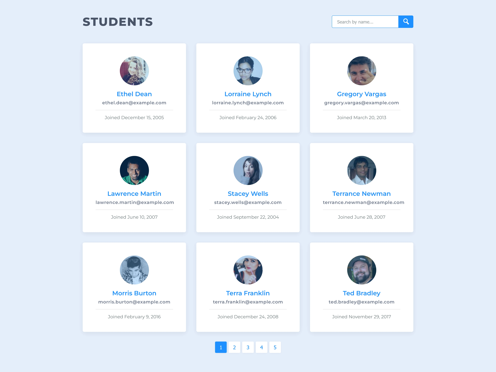

# Student List Pagination and Filtering

## Overview

This project demonstrates data pagination and filtering using a list of student profiles. It allows users to search for students by name or email, navigate through pages of student data, and see relevant details in a user-friendly format. This was my second project in the [Treehouse](https://teamtreehouse.com/) full stack JavaScript techdegree. This application is built with HTML, CSS, and JavaScript.

## Features

- **Pagination**: Display students in manageable chunks (9 students per page) with navigation controls to switch between pages.
- **Search Functionality**: Filter students by name or email using a search bar.
- **Responsive Design**: Adaptable layout for various screen sizes, enhancing usability on mobile devices.

## Technologies Used

- HTML
- CSS
- JavaScript

## Getting Started

### Prerequisites

Make sure you have a modern web browser to run the application.

### Installation

1. Clone the repository or download the ZIP file.
2. Open `index.html` in your web browser.

### Usage

1. **View Students**: The application will display a list of students.
2. **Pagination**: Use the pagination buttons to navigate through different pages of student data.
3. **Search**: Type a name or email in the search bar to filter the list of students. The pagination will update accordingly.

## API Reference

The application uses the [Random User Generator API](https://randomuser.me/) to generate random users. No API key is required.

## Example

Here is a preview of the app:

## Acknowledgments

- Thanks to the creators of the Random User Generator API for the awesome content!
- Thanks to the [Treehouse](https://teamtreehouse.com/) coding community for providing invaluable resources and support.
